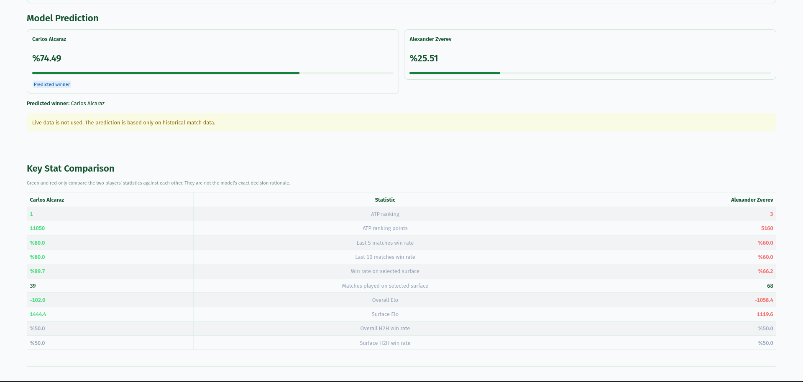
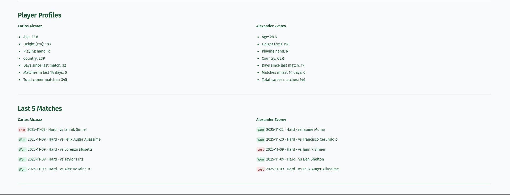

# Tennis Match Predictor

[](https://github.com/ardagurkan9/tennis-match-predictor/actions/workflows/ci.yml)

An end-to-end machine learning project for predicting professional ATP tennis match outcomes using historical results, Elo ratings, player form, match statistics, and pre-match betting odds.

The pipeline processes matches chronologically and calculates every feature using only information available before the predicted match, reducing the risk of temporal data leakage.

## Results

The production model uses LightGBM and averages predictions generated from both player perspectives.

| Evaluation set | Accuracy | ROC-AUC | Log Loss | Brier Score |
|---|---:|---:|---:|---:|
| Validation — 2024 | 67.69% | 75.24% | 0.5850 | 0.2012 |
| Retrospective benchmark — 2025 | 67.56% | 73.89% | 0.5973 | 0.2066 |

The 2025 season was inspected during development and is therefore reported as a retrospective benchmark rather than a completely untouched final test set.

## Demo

The Streamlit application allows users to configure a hypothetical matchup and view predicted win probabilities, player profiles, recent form, and statistical comparisons.

### Match Prediction and Key Statistics



### Player Profiles and Recent Form



Run the interface locally:

```bash
streamlit run app.py
```

## Key Features

- Chronological processing of ATP matches from 2000 through 2025
- Leakage-free rolling feature engineering
- Overall and surface-specific Elo ratings
- Recent-form and surface-form statistics
- Rolling serve and return performance
- Head-to-head and surface head-to-head records
- Player workload and rest-day features
- Vig-free probabilities derived from betting odds
- Logistic Regression, Random Forest, XGBoost, and LightGBM comparison
- Expanding-window model evaluation
- Symmetric matchup prediction from both player perspectives
- CLI and Streamlit prediction interfaces
- Automated leakage, prediction, and frontend tests
- Docker and GitHub Actions support

## How It Works

```text
Historical ATP matches and betting odds
                    |
                    v
           Ingestion and cleaning
                    |
                    v
     Chronological feature engineering
                    |
                    v
          Time-based data splitting
                    |
                    v
       Model training and evaluation
                    |
                    v
          CLI and Streamlit prediction
```

Each historical match is represented from both player perspectives:

```text
target_win = 1 if the selected player wins
target_win = 0 if the selected player loses
```

For a matchup between players A and B, the final probability is calculated by averaging the two directional predictions:

```text
P(A beats B) =
    (P(A beats B) + 1 - P(B beats A)) / 2
```

This reduces sensitivity to player ordering and makes prediction asymmetry measurable.

## Data Strategy

Random train-test splitting is not used because tennis results and player strength change over time.

| Purpose | Years | Used as model rows? |
|---|---|---|
| Historical feature warm-up | 2000–2014 | No |
| Training | 2015–2023 | Yes |
| Validation | 2024 | Yes |
| Retrospective benchmark | 2025 | Yes |

Matches from 2000–2014 initialize Elo ratings, player histories, recent-form statistics, and head-to-head records without being included as training rows.

## Leakage Prevention

Every chronological feature is calculated using only matches completed before the match being predicted.

The model does not use:

- Current-match scores
- Current-match serve statistics
- Post-match rankings
- Future player form
- Future head-to-head results
- Random data splitting

Automated tests verify important temporal and prediction invariants.

## Feature Groups

| Group | Examples |
|---|---|
| Player strength | ATP ranking, Elo, surface Elo |
| Recent form | Overall and surface win rates |
| Serve and return | First serve, second serve, break points, and return performance |
| Matchup history | Overall and surface head-to-head |
| Workload | Rest days, recent matches, sets, and games |
| Market information | Vig-free implied probabilities |

## Models

The training pipeline compares:

- Logistic Regression
- Random Forest
- XGBoost
- LightGBM

LightGBM is currently used as the production model.

The ablation pipeline evaluates:

- Ranking baseline
- Market baseline
- Market-only LightGBM
- Tennis-feature-only LightGBM
- Full LightGBM model

Model selection uses expanding-window validation over historical seasons rather than the 2025 retrospective benchmark.

## Project Structure

```text
tennis-match-predictor/
├── data/                 # Raw, processed, and feature datasets
├── models/               # Trained model artifacts
├── pictures/             # Streamlit screenshots
├── reports/              # Metrics, plots, and experiment reports
├── scripts/              # Utility and model download scripts
├── src/                  # Data, feature, training, and prediction modules
├── tests/                # Leakage, prediction, and frontend tests
├── app.py                # Streamlit interface
├── main.py               # Pipeline entry point
├── Dockerfile
├── Makefile
├── pyproject.toml
└── requirements.txt
```

## Getting Started

### Requirements

- Python 3.11 or 3.12
- Historical ATP match CSV files
- Historical betting-odds files for market features

### Installation

```bash
git clone https://github.com/ardagurkan9/tennis-match-predictor.git
cd tennis-match-predictor

python -m venv .venv
source .venv/bin/activate

python -m pip install -r requirements.txt
```

For Windows PowerShell:

```powershell
python -m venv .venv
.venv\Scripts\Activate.ps1
python -m pip install -r requirements.txt
```

Place ATP match files in:

```text
data/raw/
```

Place betting-odds files in:

```text
data/raw/odds/
```

## Running the Pipeline

Clean and combine the raw data:

```bash
python main.py clean
```

Build the advanced feature datasets:

```bash
python main.py advanced
```

Train the models:

```bash
python -m src.train --dataset advanced
```

Run the ablation analysis:

```bash
python -m src.ablation
```

Generate evaluation reports:

```bash
python -m src.report
```

## Prediction

Predict a hypothetical matchup from the command line:

```bash
python -m src.predict \
  --player "Carlos Alcaraz" \
  --opponent "Jannik Sinner" \
  --surface Hard \
  --date 2026-01-15 \
  --tourney-level G \
  --best-of 5 \
  --round SF
```

Optional pre-match odds can also be supplied:

```bash
python -m src.predict \
  --player "Carlos Alcaraz" \
  --opponent "Jannik Sinner" \
  --surface Hard \
  --date 2026-01-15 \
  --player-odds 1.70 \
  --opponent-odds 2.20
```

When odds are omitted, the prediction pipeline uses neutral market inputs and marks betting-market data as unavailable.

## Model Artifact

Model binaries are excluded from Git.

Download the production model:

```bash
python scripts/download_model.py
```

Alternatively, rebuild the feature dataset and train the model locally:

```bash
python main.py advanced
python -m src.train --dataset advanced
```

## Testing

Run the complete test suite:

```bash
python -m pytest
```

Run static analysis:

```bash
python -m ruff check .
```

The tests cover:

- Temporal leakage
- Prediction symmetry
- Odds matching
- Feature consistency
- Missing-model handling
- Streamlit helper logic

## Docker

Build the image after downloading or training the model:

```bash
docker build -t tennis-match-predictor .
```

Run the Streamlit application:

```bash
docker run --rm -p 8501:8501 tennis-match-predictor
```

Then open:

```text
http://localhost:8501
```

## Limitations

- Predictions are based on historical data rather than live rankings.
- Injuries, withdrawals, and personal circumstances are not modeled.
- Player information may become stale when the source dataset is not updated.
- Historical betting odds require approximate matching across external files.
- The 2025 results are retrospective rather than a completely untouched final test.
- Predicted probabilities are estimates, not guarantees.

## Roadmap

- [x] Chronological ingestion and cleaning
- [x] Leakage-free feature engineering
- [x] Multiple model comparison
- [x] Expanding-window evaluation
- [x] Automated leakage and prediction tests
- [x] CLI and Streamlit interfaces
- [x] Streamlit screenshots
- [ ] Evaluate on a future untouched ATP season
